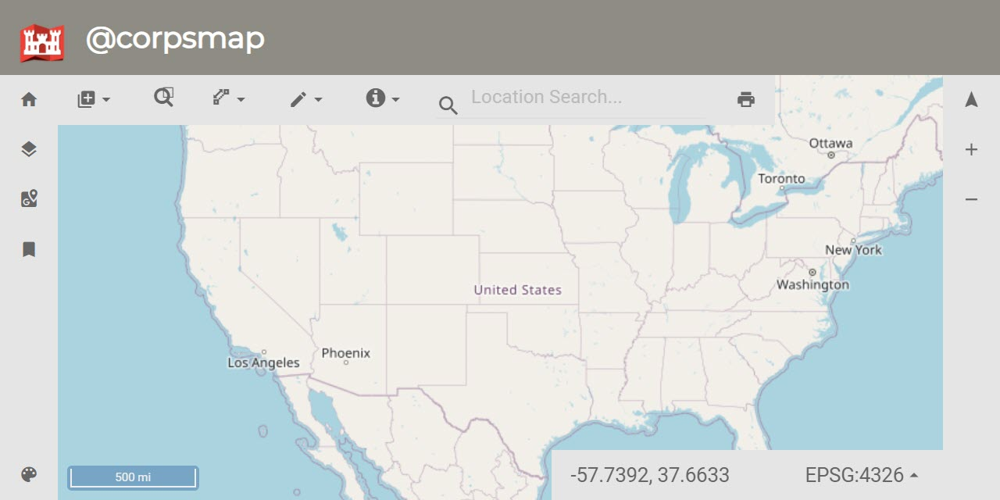

# corpsmap-docs
This site seeks to provide some general context and help for leveraging the @corpsmap packages to develop enterprise level (and beautiful) web based maps!

## About @corpsmap
@corpsmap is a project developed by Will B. to facilitate an enterprise ecosystem of geospatial applications that are loosely coupled but maintain a common set of frequently used tools. 
### GIS capabilities
The foundational gis capabilities are provided through openlayers for visualization and display and turf for the more some of the spatial analysis.

### development stack
@corpsmap utilizes the react-redux stack for state management and dispatches - it leverages react-redux-bundler to reduce the boiler-plate with rapidly developing components for the framework.

### Plugin Architecture
In order to improve flexibility of incorporating the variety of needs in a sustainable way @corpsmap leverages a plugin architecture - learn more about that here [Plugin Architecture](assets/pluginArchitecture.html "Learn about creating a plugin!")

## Index

[Getting Started](assets/gettingStarted.html "Let's get started!")

[core-plugins](assets/plugins.html "It is like an extension cord at Clark Griswold's house")

[Developing Custom Plugins](assets/custom_plugins/basic_custom_plugin.html "DIY for @corpsmap")

[openlayers-utils](assets/openlayers-utils/layer-utilities.html "Get the most utility out of your layers")
