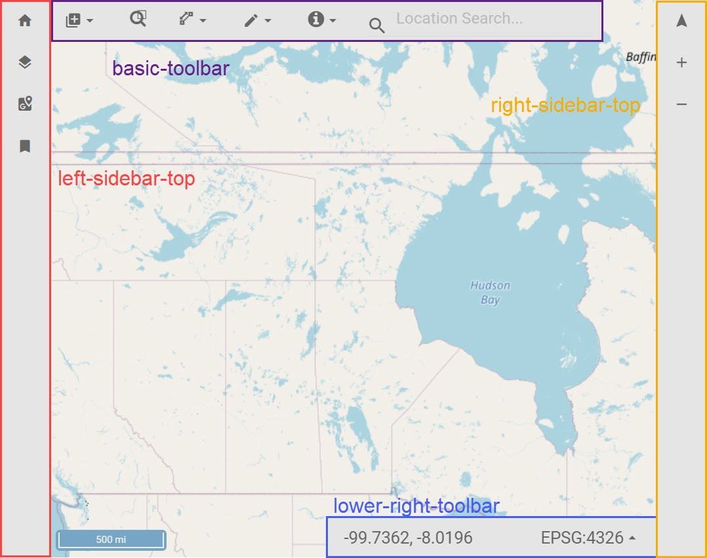

There are many plugins that come with the @corpsmap bundle, each one is independant of any of the others. These plugins provide common tools that are useful to almost any application, thus they are designed to be able to be selectable by the developer.

Plugins are added by default in the tool bar trays identified in the image above.

- [addData](plugins/addData.html "Add Data Plugin description")
- [basemapSwitcher](plugins/basemapSwitcher.html "Choose your adventure here!")
- [bookmarks](plugins/bookmarks.html "Saving that for later...")
- [coordDisplay](plugins/coorddisplay.html "Where are we?")
- [draw](plugins/draw.html "Cause haute pink is fun!")
- [geocoder](plugins/geocoder.html "Don't be so creepy.")
- [identify](plugins/identify.html "We are workin on it.")
- [measureTools](plugins/measureTools.html "Isn't this place a geographical anomoly, it is two weeks from everwhere!")
- [rotateNorth](plugins/rotateNorth.html "No, North should be up")
- [zoomInOut](plugins/zoomInOut.html "Cause some people like fixed zoom out")
- [zoomToBox](plugins/zoomToBox.html "I wanna zoom right there and I dont know how to use mousewheel scroll")
- [zoomHome](plugins/zoomHome.hmtl "Go to your home!!! Are you too good for your home?!?")
- [treeView](plugins/treeView.html "A place for layers to feel like they belong")
- [themeSwitcher](plugins/themeSwitcher.html "Because everyone deserves a choice right?")
- [printMap](plugins/printMap.html "Do people still have printers?")
