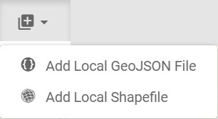

# AddData plugin
With this plugin you can add local files to the Map window. There are currently only two options for the addData plugin:
- Add local GeoJson
- Add local Shape Zip

The addData plugin is in the basic-toolbar region of the corpsmap container by default. 


## Dispatches
```
"ADD_DATA_ADDED_GEOJSON"
```
