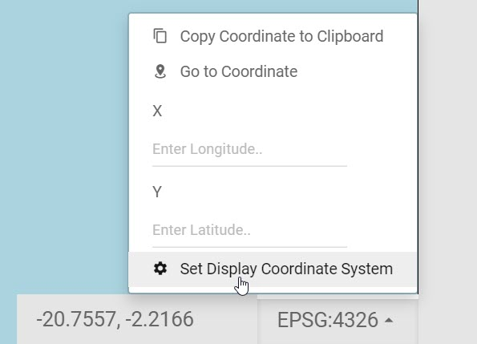

# coordDisplay

This plugin displays the mouse cursor coordinates, a tool for defining an x and y to zoom to, and a tool to change the web map's EPSG.

The coordDisplay plugin is defaulted to the lower-right-toolbar region.

