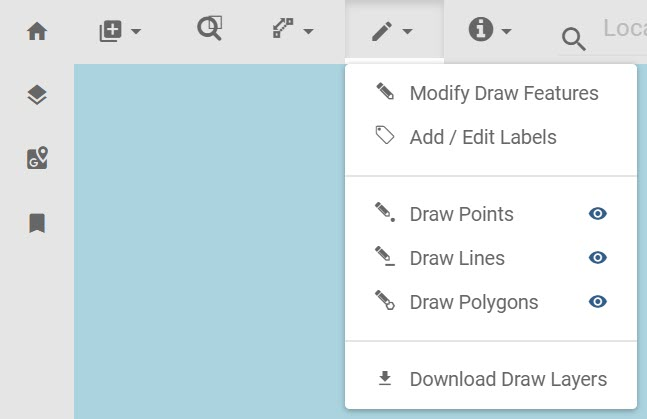

# draw
This plugin allows the user to draw points, polygons, and lines. The user can add labels to a drawn feature. The user can delete (use the delete key) a selected draw feature. The user can modify a selected feature. The user can download the file locally as a geoJson file.

The draw plugin is defaulted to the basic-toolbar region.
