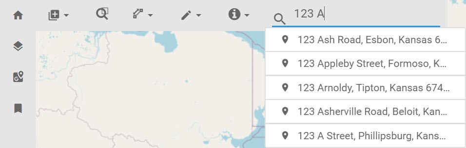

# geocoder
This plugin provides a text based search bar for addresses. When an address is selected the map will zoom and center the map on that address. This plugin is added to the basic-toolbar region by default.

