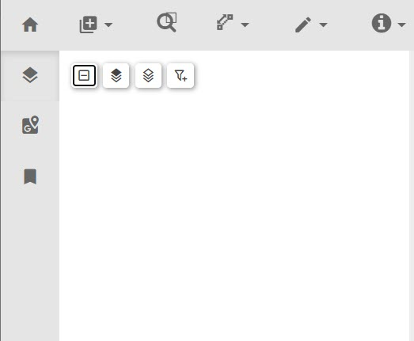

# treeView
This plugin provides a tree view of layers so that the user can turn on or off visualization of layers and manage the transparency of layers. The tree supports nested structures. The tree plugin must be added as a function in the loading of plugins. This plugin is placed in the left-sidebar-top region by default.

